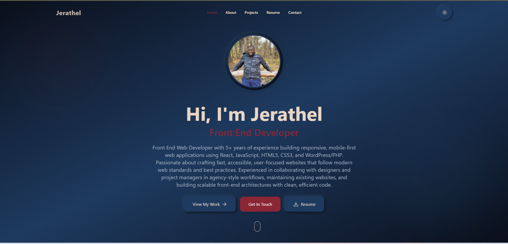

# Jerathel Czerny - Front End Developer Portfolio



A stunning, fully responsive, production-ready portfolio website featuring a unique neumorphic design with navy blue and burgundy theme colors. Built with modern web technologies to showcase professional experience, projects, and skills with an emphasis on beautiful UI/UX design.

## 🎨 Design Philosophy

This portfolio embodies modern web design principles with a perfect blend of:
- **Neumorphic Design**: Soft shadows creating depth and dimension throughout
- **Glass Morphism**: Frosted glass effects with blur on navigation elements
- **Navy Blue & Burgundy Color Scheme**: Professional yet distinctive color palette
- **Micro-interactions**: Smooth animations and hover effects for enhanced UX
- **Responsive First**: Optimized for all devices from mobile to desktop

## ✨ Key Features

### 🖼️ Visual Design
- **Profile Picture with Rotating Ring**: Subtle animated gradient ring (12s rotation) around profile photo
- **Neumorphic UI Elements**: Consistent soft shadows creating raised/embossed effects
- **Glass Navigation**: Frosted glass header and mobile navbar with backdrop blur
- **Theme Toggle**: Seamless light/dark mode switching with neumorphic toggle button
- **Smooth Animations**: Fade-ins, bouncing effects, and smooth transitions throughout

### 📱 Responsive Features
- **Desktop Navigation**: Glass morphism header with centered nav links
  - Logo: Left-aligned
  - Nav Links: Center-aligned (Home, About, Projects, Resume, Contact)
  - Theme Toggle: Right-aligned
- **Mobile Navigation**: Floating glass navbar at bottom
  - 5 neumorphic tabs with active state highlighting (burgundy)
  - Tabs change color based on scroll position
  - Glass background with navy tint for consistency
- **Back to Top Button**: Neumorphic burgundy button with slow bouncing animation
  - Centered on all screen sizes
  - Positioned above mobile navbar

### 🎯 Sections

#### Hero Section
- Professional profile photo with subtle rotating gradient ring
- Name and title with navy blue coloring
- Bio paragraph with muted text
- Three CTA buttons with light neumorphic shadows:
  - "View My Work" - Navy blue
  - "Get In Touch" - Burgundy
  - "Resume" - Navy blue with download icon

#### About Section
- Brief professional summary
- Four highlight cards with neumorphic styling:
  - Clean Code
  - Performance
  - Collaboration
  - Responsive Design
- Each card features icon, title, and description

#### Projects Section
- Filterable project showcase with 5 filters:
  - All, React, WordPress, React Native, PHP
- Three featured projects:
  - **Agency Studio Website** (PHP/WordPress)
  - **Dayding** (React Native/PostgreSQL) - Christian dating platform
  - **Rosathel Suites** (MERN Stack) - Hotel booking app
- Each project card includes:
  - Project screenshot
  - Name and description
  - Technology tags with inset neumorphic effect
  - "View Project" link
- Neumorphic cards with soft shadows

#### Contact Section
- Functional contact form with backend integration
- Three contact info cards (email, phone, location)
- Form fields with inset neumorphic styling:
  - Name (min 2 characters)
  - Email (valid format required)
  - Subject (min 3 characters)
  - Message (min 10 characters)
- Real-time validation with beautiful error messages
- Neumorphic error/success cards with:
  - Red border and icon for errors
  - Green border and icon for success
  - Background matching site theme
- MongoDB storage for submissions
- Email notifications (configurable SMTP)

#### Resume Page
- Downloadable PDF resume (clean filename: "Jerathel-Czerny-Resume.pdf")
- Neumorphic download button
- Sections matching PDF layout:
  - Professional Summary
  - Employment History (with timeline design)
  - Education
  - Skills (Languages, Design, Tools)
  - Links (Portfolio, LinkedIn, GitHub)
- Theme-aware styling (light/dark mode)
- Scrolls to top on page load

### 🎨 Theme System
- **Dark Mode** (Default):
  - Navy blue (#1e3a5f) primary backgrounds
  - Dark (#0a0f1a) secondary backgrounds
  - Cream (#e8d5c4) text
  - Burgundy (#8b2635) accents
  
- **Light Mode**:
  - Cream/beige (#f5f5f5, #e8d5c4) backgrounds
  - White (#ffffff) card backgrounds
  - Navy blue (#1e3a5f) text
  - Burgundy (#8b2635) accents

- All components dynamically adapt to theme using CSS variables
- Theme preference saved in localStorage

## 🛠️ Technologies Used

### Frontend
- **React 19** - Modern UI library
- **React Router DOM v7** - Client-side routing
- **Tailwind CSS v3** - Utility-first CSS framework
- **Lucide React** - Beautiful icon library (no emoji icons)
- **Axios** - HTTP client for API requests
- **shadcn/ui Components** - Pre-built accessible components

### Backend
- **FastAPI** - Modern Python web framework
- **MongoDB with Motor** - Async NoSQL database
- **Pydantic** - Data validation
- **aiosmtplib** - Async email sending
- **CORS Middleware** - Cross-origin resource sharing

### Development Tools
- **Yarn** - Package manager
- **Supervisor** - Process control system
- **Hot Reload** - Enabled for both frontend and backend

## 📁 Project Structure

```
/app
├── frontend/
│   ├── src/
│   │   ├── components/          # Reusable UI components
│   │   │   ├── Header.jsx       # Navigation with glass effect
│   │   │   ├── Footer.jsx       # Site footer
│   │   │   ├── Hero.jsx         # Hero section with profile
│   │   │   ├── About.jsx        # About section
│   │   │   ├── Projects.jsx     # Projects showcase
│   │   │   ├── Contact.jsx      # Contact form
│   │   │   ├── ProfilePicture.jsx   # Profile with rotating ring
│   │   │   ├── BackToTop.jsx    # Back to top button
│   │   │   └── ThemeToggle.jsx  # Theme switcher
│   │   ├── pages/
│   │   │   ├── Home.jsx         # Main landing page
│   │   │   └── Resume.jsx       # Resume page
│   │   ├── context/
│   │   │   └── ThemeContext.jsx # Theme state management
│   │   ├── mockData.js          # Portfolio data
│   │   ├── App.js               # Main app component
│   │   ├── App.css              # Custom animations
│   │   └── index.css            # Global styles & theme variables
│   ├── public/
│   │   └── index.html
│   ├── package.json
│   └── .env                      # Environment variables
├── backend/
│   ├── server.py                # FastAPI application
│   ├── models.py                # Pydantic models
│   ├── email_service.py         # Email notification service
│   ├── requirements.txt
│   └── .env                      # Backend environment variables
├── contracts.md                  # API contracts documentation
└── README.md                     # This file
```

## 🚀 Getting Started

### Prerequisites
- Node.js (v14+)
- Python 3.8+
- MongoDB
- Yarn package manager

### Installation

1. **Clone and Navigate**
   ```bash
   cd /app
   ```

2. **Install Frontend Dependencies**
   ```bash
   cd frontend
   yarn install
   ```

3. **Install Backend Dependencies**
   ```bash
   cd backend
   pip install -r requirements.txt
   ```

### Running the Application

#### Development Mode

**Frontend** (runs on port 3000):
```bash
cd frontend
yarn start
```

**Backend** (runs on port 8001):
```bash
cd backend
uvicorn server:app --reload --host 0.0.0.0 --port 8001
```

#### Production Mode (with Supervisor)

```bash
# Start all services
sudo supervisorctl start all

# Restart individual services
sudo supervisorctl restart frontend
sudo supervisorctl restart backend

# Check status
sudo supervisorctl status
```

### Environment Variables

**Frontend** (`/app/frontend/.env`):
```env
REACT_APP_BACKEND_URL=https://your-domain.com
WDS_SOCKET_PORT=443
ENABLE_HEALTH_CHECK=false
```

**Backend** (`/app/backend/.env`):
```env
MONGO_URL=mongodb://localhost:27017
DB_NAME=portfolio_db
SMTP_HOST=smtp.gmail.com
SMTP_PORT=587
SMTP_USER=your-email@gmail.com
SMTP_PASSWORD=your-app-password
ADMIN_EMAIL=jerathelczerny@yahoo.com
```

## 📊 API Endpoints

### `GET /api/`
Health check endpoint
```json
{
  "message": "Portfolio API is running"
}
```

### `GET /api/health`
System health status
```json
{
  "status": "healthy",
  "email_configured": true
}
```

### `POST /api/contact`
Submit contact form
```json
{
  "name": "John Doe",
  "email": "john@example.com",
  "subject": "Project Inquiry",
  "message": "I would like to discuss..."
}
```

Response:
```json
{
  "success": true,
  "message": "Message received successfully. I'll get back to you soon!",
  "id": "uuid"
}
```

### `GET /api/contacts`
Retrieve all contacts (admin endpoint)
```json
{
  "contacts": [...],
  "count": 5
}
```

## 🎨 Design System

### Color Palette
```css
/* Dark Theme */
--bg-hero-from: #0a0f1a
--bg-hero-via: #1e3a5f
--bg-hero-to: #0a0f1a
--bg-section: #0a0f1a
--bg-card: #1e3a5f
--text-primary: #e8d5c4
--text-secondary: #8b2635
--text-muted: #a0aec0

/* Light Theme */
--bg-hero-from: #e8d5c4
--bg-hero-via: #f5f5f5
--bg-hero-to: #ffffff
--bg-section: #f5f5f5
--bg-card: #ffffff
--text-primary: #1e3a5f
--text-secondary: #8b2635
--text-muted: #4a5568
```

### Neumorphic Shadow System
```css
/* Outset (raised elements) */
box-shadow: 4px 4px 16px var(--shadow-color-1), 
            -4px -4px 16px var(--shadow-color-2)

/* Inset (pressed elements) */
box-shadow: inset 2px 2px 6px var(--shadow-color-1), 
            inset -2px -2px 6px var(--shadow-color-2)

/* Glass morphism */
background: rgba(30, 58, 95, 0.15);
backdrop-filter: blur(20px);
box-shadow: 6px 6px 20px rgba(10, 15, 26, 0.4), 
            -6px -6px 20px rgba(255, 255, 255, 0.1), 
            inset 1px 1px 2px rgba(255, 255, 255, 0.2)
```

### Typography
- Headings: Bold, navy blue in light mode, cream in dark mode
- Body: Regular weight, muted colors for readability
- Links: Burgundy (#8b2635) for all interactive elements

### Spacing
- Section padding: py-20 (80px vertical)
- Card padding: p-6 to p-8 (24px - 32px)
- Gap between elements: gap-4 to gap-8 (16px - 32px)

## 📱 Responsive Breakpoints

```css
/* Mobile */
@media (max-width: 767px) {
  - Floating glass navbar at bottom
  - Single column layouts
  - Back to top button at bottom-24 (6rem)
}

/* Tablet */
@media (min-width: 768px) and (max-width: 1023px) {
  - Glass header at top
  - 2-column grid layouts
}

/* Desktop */
@media (min-width: 1024px) {
  - Full desktop navigation
  - 3-4 column grid layouts
  - Back to top button at bottom-8 (2rem)
}
```

## 🔧 Customization

### Updating Personal Information
Edit `/app/frontend/src/mockData.js`:
```javascript
export const personalInfo = {
  name: "Your Name",
  title: "Your Title",
  email: "your@email.com",
  phone: "(123) 456-7890",
  location: "City, State",
  bio: "Your bio here...",
  portfolio: "your-portfolio.com",
  linkedin: "linkedin.com/in/yourprofile",
  github: "github.com/yourusername"
};
```

### Adding Projects
```javascript
export const projects = [
  {
    id: 1,
    name: "Project Name",
    description: "Project description...",
    technologies: ["Tech1", "Tech2", "Tech3"],
    category: "React", // or "WordPress", "React Native", "PHP"
    image: "https://image-url.com/image.jpg",
    link: "https://project-link.com",
    featured: true
  }
];
```

### Changing Colors
Update `/app/frontend/src/index.css`:
```css
.dark {
  --bg-card: #your-color;
  --text-primary: #your-color;
  --text-secondary: #your-color;
}
```

## 🧪 Testing

### Backend Testing
```bash
# Test health endpoint
curl https://your-domain.com/api/health

# Test contact form
curl -X POST https://your-domain.com/api/contact \
  -H "Content-Type: application/json" \
  -d '{"name":"Test","email":"test@example.com","subject":"Test","message":"Testing contact form"}'
```

### Frontend Testing
1. Open browser developer tools
2. Test responsive design at different breakpoints
3. Toggle theme and verify all components adapt
4. Submit contact form with valid/invalid data
5. Test navigation and smooth scrolling

## 📈 Performance Optimizations

- **Code Splitting**: React lazy loading for routes
- **Image Optimization**: Compressed images with appropriate formats
- **CSS**: Tailwind purges unused styles in production
- **Bundle Size**: Optimized with tree shaking
- **Caching**: Browser caching for static assets
- **Hot Reload**: Fast development with instant updates

## 🔒 Security Features

- **CORS**: Configured for allowed origins
- **Input Validation**: Pydantic models validate all inputs
- **SQL Injection**: MongoDB prevents SQL injection
- **XSS Protection**: React escapes output by default
- **Environment Variables**: Sensitive data in .env files

## 🚀 Deployment

### Frontend Deployment
```bash
cd frontend
yarn build
# Deploy /build folder to hosting service
```

### Backend Deployment
- Use Supervisor for process management
- Configure reverse proxy (Nginx recommended)
- Set up SSL certificate
- Configure environment variables
- Set up MongoDB connection

### Docker (Optional)
```dockerfile
# See existing docker configuration
```

## 📄 License

This project is open source and available under the MIT License.

## 👤 Author

**Jerathel Czerny**
- Email: jerathelczerny@yahoo.com
- Phone: (917) 751-7033
- Location: Derry, NH, United States
- Portfolio: a-jerathel-portfolio.vercel.app
- LinkedIn: linkedin.com
- GitHub: github.com

## 🙏 Acknowledgments

- Design inspired by modern neumorphic UI patterns
- Icons from Lucide React
- Project screenshots from actual applications
- shadcn/ui for accessible component primitives

## 📝 Version History

- **v1.0.0** (Current)
  - Initial release with full neumorphic design
  - Light/dark theme support
  - Fully functional contact form with backend
  - 3 featured projects with filtering
  - Resume page with PDF download
  - Mobile-responsive glass navigation
  - Profile picture with rotating ring animation

---

**Built with ❤️ using React, FastAPI, and MongoDB**

*Last Updated: January 2026*